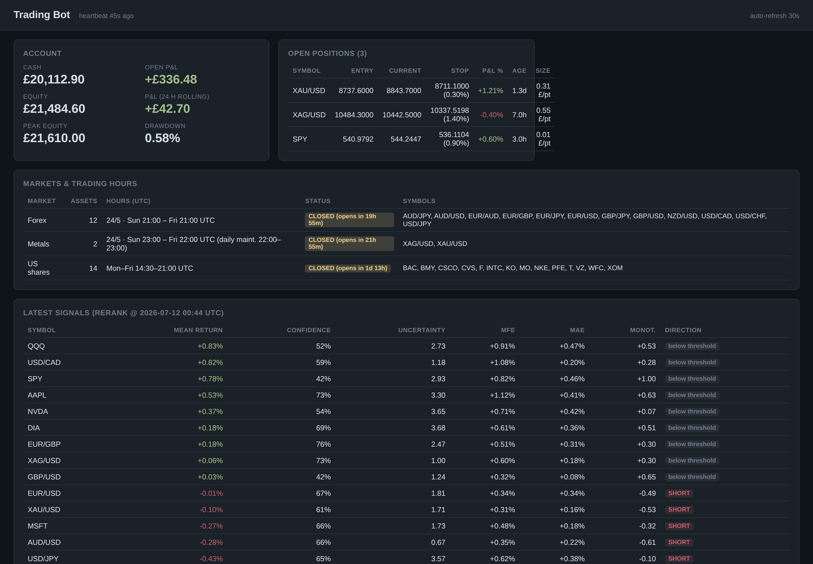

# async-trading-engine

[](https://github.com/protereus/async-trading-engine/actions/workflows/ci.yml)
[](LICENSE)
[](https://www.python.org/downloads/)

An asynchronous algorithmic trading engine for IG Group spread betting, built on
Python `asyncio`. It uses the [Kronos](https://github.com/shiyu-coder/Kronos)
time-series foundation model to rank a 28-asset universe (FX, metals, US shares),
generate probabilistic entry signals, and size positions against a multi-layer
risk-management system.

> ⚠️ **Disclaimer** — This is an educational / research project. Spread betting and
> leveraged trading carry a high risk of losing money. Nothing in this repository
> is financial advice. If you run it, run it against a **demo** account first, use
> capital you can afford to lose, and calibrate the signal thresholds for your own
> data before trusting any entry it takes.

## Highlights

- **Fully asynchronous** — single `asyncio` event loop; REST via `aiohttp`,
  streaming via Lightstreamer WebSockets, no blocking I/O.
- **ML-driven strategy** — dual-pass Monte-Carlo inference over a time-series
  foundation model, top-K cross-sectional selection, correlation-aware
  portfolio construction.
- **Defense-in-depth risk layer** — per-trade sizing, drawdown tiers, rolling
  loss limits, margin caps, spread-anomaly and volatility circuit breakers.
- **Crash-safe** — atomic JSON state persistence, SQLite WAL candle store,
  startup reconciliation against the broker's open-position list.
- **Heavily tested** — 1,200+ pytest cases (unit + integration) with async
  mocks for every external dependency; 80%+ line coverage enforced in CI;
  strict mypy; ruff-clean.
- **Observable** — Telegram alerting, heartbeat healthchecks, and a read-only
  FastAPI dashboard.


*The read-only dashboard (`webgui/`), rendering synthetic demo data.*

## Architecture

```text
bot.main
├── EODHDFeed                   — 1h intraday backfill (REST) + WS tick→1h aggregation
│     └── eodhd_symbols.py      — 28-symbol universe (bot_key → data source / IG EPIC /
│                                 asset class / pip value / sector)
├── IGClient (aiohttp REST)     — orders, balance, positions (spread-bet account)
├── IGFeed (Lightstreamer)      — server-side stop monitoring / account channel
├── IGCandleLSFeed (Lightstreamer) — IG-native XAU/XAG spot candles (1h, 24/5)
├── TopKStrategy (Kronos)       — MC batch inference, asset ranking, signal generation
├── CorrelationTracker          — rolling Pearson matrix, redundancy filter
├── TakeProfitManager           — five independent exit components (path-aware)
├── RiskManager                 — sizing, drawdown tiers, loss limits, margin caps
├── SentimentEngine (optional)  — multi-agent LLM sentiment overlay + entry gate
├── CandleDB (SQLite WAL)       — candles, signal history, correlations, sentiment
├── TelegramAlerter (aiohttp)   — trade/risk/rerank notifications
├── StateManager (JSON)         — atomic crash-recovery state
└── webgui/                     — read-only FastAPI dashboard (127.0.0.1:8080)
```

**Data flow**

1. **Backfill** (startup): per-symbol 1h REST history → in-memory store + SQLite
   (warmed from SQLite first; only symbols below the required context depth are fetched).
2. **Live**: WebSocket ticks are aggregated locally into `:00`-aligned hourly candles →
   `EVENT_NEW_CANDLE`. Metals stream separately from IG spot via Lightstreamer.
3. Every confirmed candle runs stop-loss / take-profit checks on open positions.
4. On a configurable cadence, `TopKStrategy.scan()` re-ranks the universe and
   updates the allowed-entry list.
5. When a rerank promotes an asset into the top-K, an entry order is placed on the
   next candle — after the full risk-check chain passes.

## Strategy — Kronos TopK

Each scan runs the universe through two inference passes (assets are batched into
homogeneous feature groups: OHLCV vs OHLC-only):

| Pass | Purpose | Temperature |
|---|---|---|
| 1 — point estimate | sharp OHLC path (mean return, path metrics) | low (0.6) |
| 2 — variance | Monte-Carlo spread → uncertainty, direction confidence | high (1.0) |

Per asset the engine derives `mean_return`, `direction_confidence`, `uncertainty`,
and path metrics (`predicted_mfe/mae`, peak bar, monotonicity), then filters through
configurable thresholds and ranks survivors by a path-aware ranking score. A
correlation filter walks the ranked list and drops candidates too correlated with
already-selected symbols. The top-K survivors form the active selection.

**Signal thresholds ship wide-open by design.** The defaults only reject degenerate
signals — they are *not* calibrated. After the bot has logged a few weeks of
`signal_history`, run the built-in calibration sweep and pick thresholds from your
own data:

```bash
uv run python scripts/calibrate_thresholds.py --help
```

Exits: stop-loss is checked on every candle; take-profit runs five independently
toggleable components (static TP, two-stage trailing, signal decay, time exit,
sentiment reversal), with stop-loss superseding all of them.

## Risk protection

Every order passes `RiskManager.evaluate_ig_order()` — cheapest checks first,
fail-fast, a failed check blocks the order and alerts:

- **Sizing** — `stake = equity × risk_per_trade_pct / stop_distance` (default 1%/trade).
- **Portfolio caps** — total £-at-risk cap across open positions; max-position count.
- **Drawdown tiers** — position-size multipliers shrink as drawdown deepens; the
  deepest tier halts new entries (debounced, auto-clears on recovery).
- **Loss limits** — rolling daily/weekly/monthly loss limits; consecutive-loss pause.
- **Market microstructure guards** — margin-utilisation cap, volatility circuit
  breaker, order rate limit, pre-trade margin estimate, spread-anomaly block.

Market hours are enforced per asset class (`trading_hours.py`): entries use a strict
`is_safe_for_entry` (blocked around funding/maintenance windows), closes use a
lenient `is_market_open` so a position is never trapped.

The risk layer was built against a written specification of everything the demo
environment hides — slippage, forced liquidation at the 50% margin floor, overnight
funding multipliers, Lightstreamer silent thread death. The spec, with each mandate
mapped to the module that implements it and the tests that pin it, lives in
[`docs/IG_LIVE_RISK_REFERENCE.md`](docs/IG_LIVE_RISK_REFERENCE.md).

## Quickstart

Requirements: Python 3.12+, [`uv`](https://docs.astral.sh/uv/), an IG demo account,
an EODHD subscription (intraday + WebSocket), and a
[Kronos](https://github.com/shiyu-coder/Kronos) checkout (weights auto-download
from HuggingFace on first run).

```bash
git clone https://github.com/protereus/async-trading-engine.git
cd async-trading-engine
uv sync --extra webgui          # bare `uv sync` omits the dashboard deps
uv run python scripts/setup.py  # guided first-run configuration → writes .env
uv run python -m bot.main
```

Prefer manual configuration? `cp .env.example .env` and fill in the values — the
template documents every knob and its sane range.

### Key configuration

| Variable | Description | Default |
|---|---|---|
| `IG_DEMO_API` / `IG_DEMO_USERNAME` / `IG_DEMO_PASSWORD` | IG demo credentials | required |
| `CANDLE_EXCHANGE` | `eodhd` (primary) / `twelvedata` (FX failover) / `ig` | `eodhd` |
| `EODHD_API` | EODHD API token | required |
| `TOPK_ENABLED` | enable the Kronos TopK strategy | `true` |
| `KRONOS_DIR` | path to a Kronos checkout | required |
| `TOPK_K` | max simultaneous positions | 3 |
| `TOPK_MIN_CONFIDENCE` | entry filter, range 0.50–0.95 | 0.60 (wide) |
| `TOPK_MAX_UNCERTAINTY` | entry filter, range 1–100 | 5.0 (wide) |
| `TOPK_MIN_PREDICTED_RETURN` | entry filter, range 0–0.02 | 0.001 (wide) |
| `TOPK_CORRELATION_MAX` | correlation filter, 1.0 disables | 0.75 |
| `RISK_PER_TRADE_PCT` | equity fraction risked per trade | 0.01 |
| `SENTIMENT_ENABLED` | optional LLM sentiment overlay | `false` |
| `TELEGRAM_BOT_TOKEN` / `TELEGRAM_CHAT_ID` | Telegram alerts | optional |

The full annotated list lives in [`.env.example`](.env.example). Environment values
always override code defaults.

## Testing & quality

The test suite is the backbone of the project — every broker interaction, feed
event, risk check, and exit path is exercised against async mocks (no network, no
model download needed):

```bash
uv run pytest              # full suite
uv run pytest -m preflight # deterministic pre-go-live validation gate
uv run mypy src/           # strict mode
uv run ruff check . && uv run ruff format --check .
```

CI runs the same three gates (ruff → mypy → pytest) on every push and pull request,
with line coverage gated at 80% — see [`.github/workflows/ci.yml`](.github/workflows/ci.yml).

Patterns worth a look if you're evaluating the test design:

- `tests/conftest.py` — a single autouse fixture that zeroes the IG REST retry
  backoff, so error-path tests exercise the full 6-step retry chain without
  burning real seconds; suite-specific fixtures live next to the tests they serve.
- `tests/test_main_integration.py` — end-to-end event-loop integration tests with a
  fully mocked broker; the module docstring lists real bugs the unit suite missed
  and this layer caught.
- `tests/test_take_profit_path_aware.py` — exit-priority interactions across the
  five take-profit components.
- `tests/test_take_profit.py` — a synthetic ex-dividend audit that pins a *known
  remaining exposure* so the fix can flip the assertions when it lands.
- `tests/test_webgui_error_handling.py` — asserts the dashboard can never leak
  internal paths or secrets in error responses.

## Operations notes

- The bot runs fine under systemd — example units are in [`deploy/`](deploy/).
- SQLite runs in WAL mode: never copy a live DB file; snapshot with
  `sqlite3 candles.db "VACUUM INTO 'backup.db'"`.
- Session tokens are cached to `.ig_session_cache.json` (0600) to respect IG's
  login rate limit.
- The dashboard (`webgui/`, separate process) is read-only and binds to localhost.

## Project history

This engine was developed privately and open-sourced as a portfolio piece. The git
history was squashed to a single release commit for publication; the
commit-by-commit development history predates the public repository.

## License

[MIT](LICENSE)
